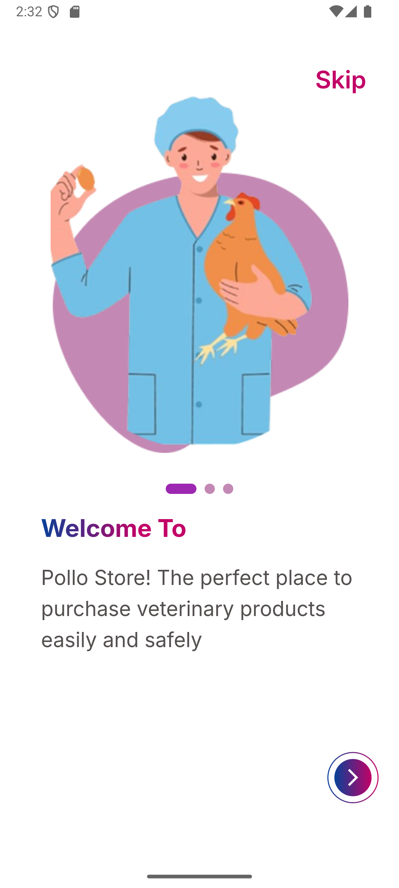
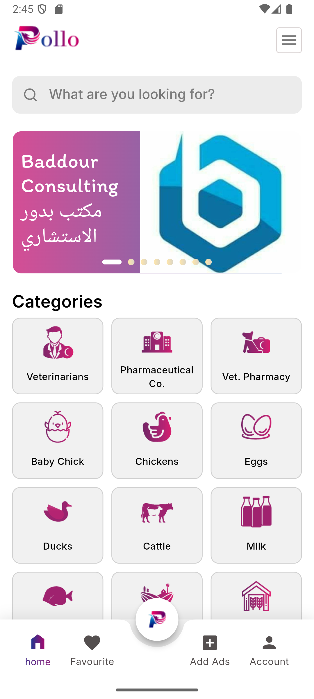
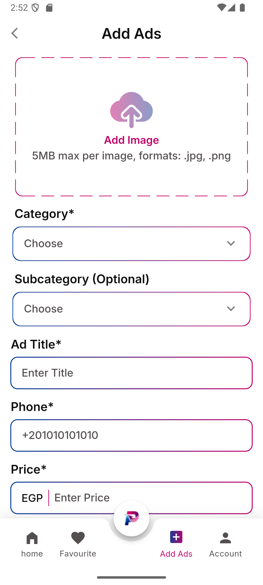
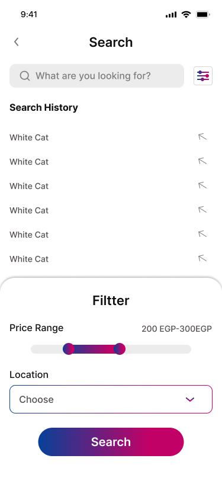

  

# 🐾 Pollo - Pet Marketplace & Veterinary App

**Pollo** is a **Flutter mobile app** that provides a complete veterinary solution for buying pets, medicines, and vaccines with secure online payments and a seamless user experience.

---

## ✨ Key Features

✅ **Pet Marketplace:** Buy & browse pets (dogs, cats, birds, reptiles, etc.)  
✅ **Medicine & Vaccine Store:** Advanced filters & barcode search  
✅ **Smart Filters:** By type, breed, price, and health requirements  
✅ **Promotions & Notifications:** Discounts & new arrivals alerts  
✅ **Clean UI & Animations:** Modern, responsive design  
✅ **Firebase Authentication & Notifications**

---

## 🎥 Demo

✨ Watch the app in action:

- [📱 Watch Demo Video 1](https://drive.google.com/file/d/1mTrY1bQVJxwE16REfF_JCemtBH2y-TXY/view?usp=drive_link)
- [📱 Watch Demo Video 2](https://drive.google.com/file/d/1G7XqDHMznjefbj4_mjjX4l2gDGuLF1Ll/view?usp=drive_link)

---

## 📱 Screenshots

  
  
  
  
  

---

## 🚀 Built With

- **Flutter & Dart**
- **MVVM architecture**
- **Bloc state management**
- **REST API integration (Dio)**
- **Firebase**
- **Git & GitHub**

---

## 🛠️ Tech Stack

  
  
  
  

---

## 🤝 Connect

---

⭐ This repository is for **showcasing the project only (code is private)**.  
If you’re interested in collaboration, feel free to connect!
